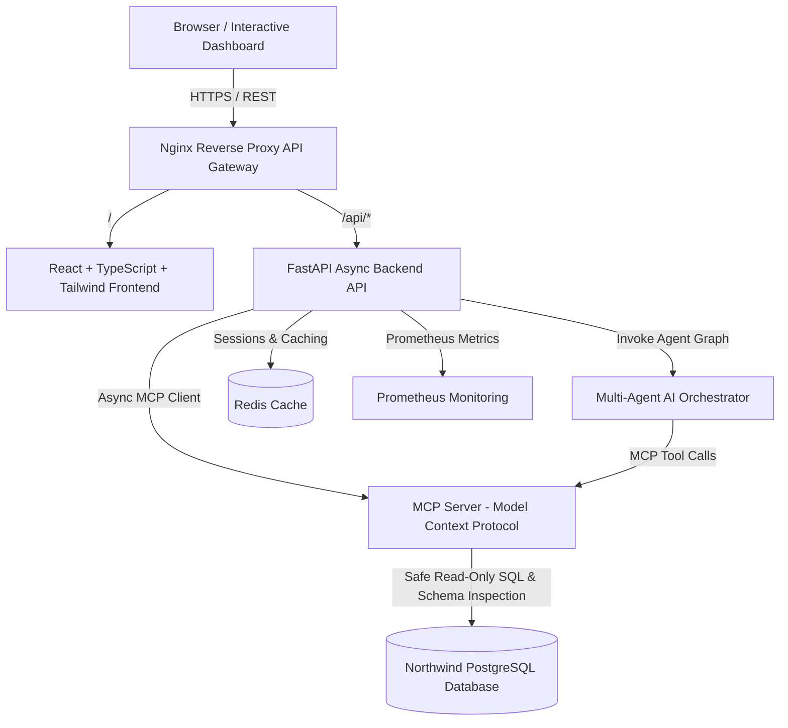

# 🚀 Northwind AI Enterprise Platform - Data Engineering + MCP + Multi-Agent AI + Interactive BI Dashboard

[](https://opensource.org/licenses/MIT)
[](https://www.python.org/)
[](https://fastapi.tiangolo.com/)
[](https://reactjs.org/)
[](https://www.typescript.org/)
[](https://tailwindcss.com/)
[](https://modelcontextprotocol.io/)
[](https://www.docker.com/)

Solution completa e escalável de **Engenharia de Dados + Inteligência Artificial Generativa + Model Context Protocol (MCP)** sobre a base de dados clássica **Northwind**. 

O sistema combina um **Dashboard Interativo em React/TypeScript estilo Power BI**, um **Servidor MCP Oficial**, um **Orquestrador Multi-Agente (SQL Agent, Data Analyst Agent, Visualization Agent, Business Insight Agent, Documentation Agent)**, um **Backend FastAPI de alta performance**, e observabilidade completa via **Prometheus e OpenTelemetry**, rodando 100% via **Docker Compose**.

---

## 🏛️ Diagrama de Arquitetura



---

## ✨ Principais Funcionalidades

- **💬 Chatbot IA Contextual Universal**: Presente em todas as 14 páginas do Dashboard (Home, Clientes, Pedidos, Produtos, Funcionários, Categorias, Fornecedores, Vendas, Faturamento, KPIs, Análises, Previsões, Insights, Admin), identificando automaticamente o contexto ativo.
- **🔌 Servidor MCP Oficial**: Implementação completa das especificações do Model Context Protocol expondo ferramentas para inspeção de esquema, metadados, execução de SQL sanitizado, KPIs, séries temporais e recomendação automática de gráficos.
- **🤖 Orquestração Multi-Agente**:
  - **SQL Agent**: Traduz linguagem natural em SQL seguro para PostgreSQL, prevenindo qualquer instrução destrutiva (`DROP`, `DELETE`, `UPDATE`, `INSERT`, `ALTER`, etc.) via análise sintática AST.
  - **Data Analyst Agent**: Calcula totais, médias, ticket médio, YoY growth e rankings.
  - **Visualization Agent**: Analisa o formato dos dados e sugere a melhor visualização (Bar Chart, Pie Chart, Line Chart, Scatter Plot, Treemap, Gauge, Heatmap).
  - **Business Insight Agent**: Sintetiza conclusões narrativas executivas e alertas operacionais.
  - **Documentation Agent**: Documenta fórmulas e regras de negócio aplicadas.
- **📊 Dashboard Corporativo Interativo**: Estilo Power BI com suporte a tema escuro/claro, cartões KPI, gráficos dinâmicos Recharts/ECharts, tabelas interativas e exportação de dados.
- **🐳 Implantação 100% Docker Compose**: Configuração simplificada de 8 microserviços contêinerizados (frontend, backend, mcp-server, ai-orchestrator, postgres, redis, nginx, prometheus).

---

## 📂 Estrutura do Monorepo

```text
northwind-data-pipeline/
├── apps/
│   ├── frontend/         # Dashboard React 18 + TypeScript + Vite + TailwindCSS + Recharts
│   ├── backend/          # Backend FastAPI Async + JWT Security + Dashboard API
│   ├── mcp-server/       # Servidor Model Context Protocol (MCP) + Tools + Schema Reflection
│   └── ai-orchestrator/  # Orquestrador Multi-Agente (SQL, Analyst, Vis, Insight, Doc)
├── infra/
│   ├── docker/postgres/  # Scripts SQL PostgreSQL de inicialização (01_schema.sql, 02_data.sql)
│   ├── nginx/            # Proxy Reverso Nginx API Gateway
│   └── monitoring/       # Configuração do Prometheus Scraper
├── docs/                 # Documentação técnica detalhada (Arquitetura, MCP, Agentes, Deploy)
├── tests/                # Testes automatizados pytest para ferramentas MCP e segurança SQL
├── docker-compose.yml    # Orquestração de todos os serviços Docker
└── Makefile              # Comandos de atalho para build, execução e testes
```

---

## ⚡ Como Executar o Projeto

### Pré-requisitos
- **Docker** (v20.10+) e **Docker Compose** (v2.0+)

### 1. Clonar o Repositório
```bash
git clone https://github.com/Gads1208/northwind-data-pipeline.git
cd northwind-data-pipeline
```

### 2. Iniciar a Aplicação via Docker Compose
```bash
make build
make up
```
*Ou diretamente:*
```bash
docker compose build
docker compose up -d
```

### 3. Acessar a Aplicação
- **Dashboard BI Interativo**: [http://localhost](http://localhost)
- **API Swagger Backend**: [http://localhost:8000/docs](http://localhost:8000/docs)
- **Servidor MCP Tools API**: [http://localhost:8001/mcp/tools](http://localhost:8001/mcp/tools)
- **Métricas Prometheus**: [http://localhost:9090](http://localhost:9090)

---

## 📚 Documentação Técnica Detalhada

- 📐 [Documentação de Arquitetura](docs/ARCHITECTURE.md)
- 🔌 [Especificação de Ferramentas MCP](docs/MCP_SPECIFICATION.md)
- 🤖 [Fluxo do Sistema Multi-Agente](docs/MULTI_AGENT_WORKFLOW.md)
- 🚀 [Guia Completo de Implantação](docs/DEPLOYMENT_GUIDE.md)

---

## 📜 Licença

Este projeto é disponibilizado sob a licença [MIT](LICENSE).
