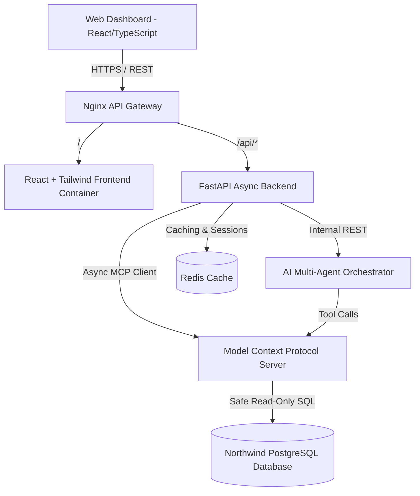

# 🏗️ System Architecture & Engineering Specifications

This document outlines the architecture, software design principles, and microservice integration flow for the **Northwind AI Enterprise Platform**.

---

## 🏛️ Architectural Overview

The system is constructed as an asynchronous microservices monorepo wrapped in Docker Compose.



---

## 🧩 Monorepo Organization

```text
northwind-data-pipeline/
├── apps/
│   ├── frontend/         # React 18 + Vite + TypeScript + TailwindCSS + Recharts
│   ├── backend/          # FastAPI Async Python Backend + JWT + REST endpoints
│   ├── mcp-server/       # Model Context Protocol (MCP) Server + Tool Handlers
│   └── ai-orchestrator/  # Multi-Agent Engine (SQL, Analyst, Vis, Insights, Doc Agents)
├── infra/
│   ├── docker/postgres/  # PostgreSQL schemas (01_schema.sql) and seed data (02_data.sql)
│   ├── nginx/            # Reverse proxy gateway configuration
│   └── monitoring/       # Prometheus scraper config & Grafana templates
├── docs/                 # Architectural specifications, MCP docs, deployment guides
└── tests/                # Automated pytest suite for MCP tools & SQL safety
```

---

## 🛡️ Software Design Principles

- **Clean Architecture**: Decoupled domain entities, use cases, and HTTP controllers.
- **Domain Driven Design (DDD)**: Expressive bounded contexts separating MCP tools, Agent workflows, and Dashboard APIs.
- **SOLID & Clean Code**: Single-responsibility agent modules, dependency injection, and interface segregation.
- **Defensive SQL Security**: Strict AST parsing (`sqlglot`) ensuring zero mutating SQL statements (`DROP`, `DELETE`, `INSERT`, `UPDATE`, `ALTER`, `TRUNCATE`) are executed.
